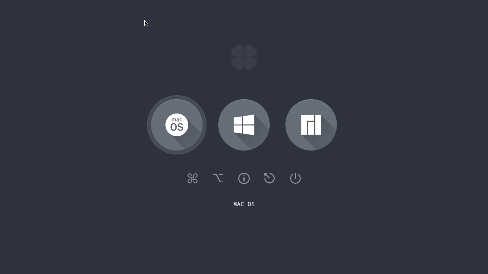
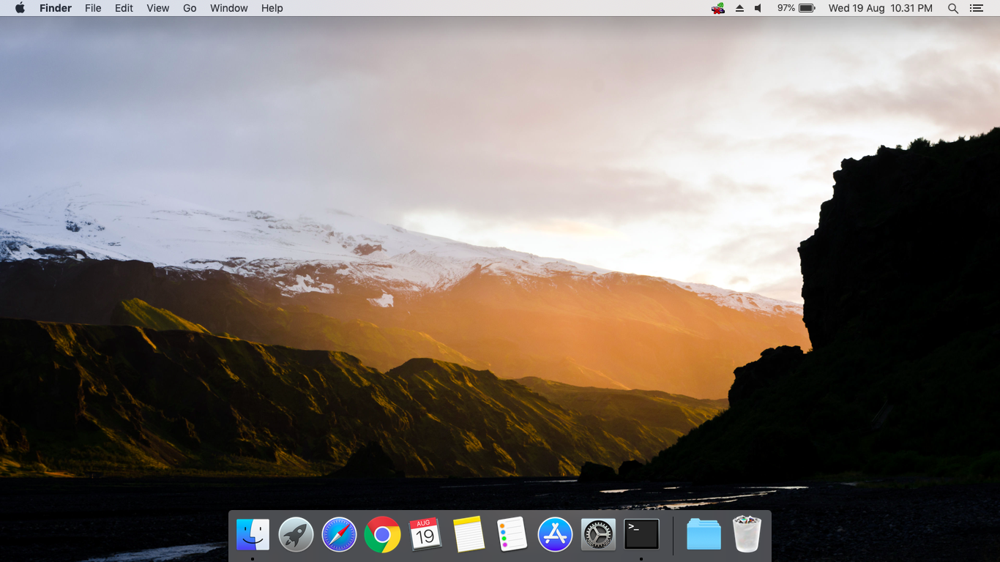
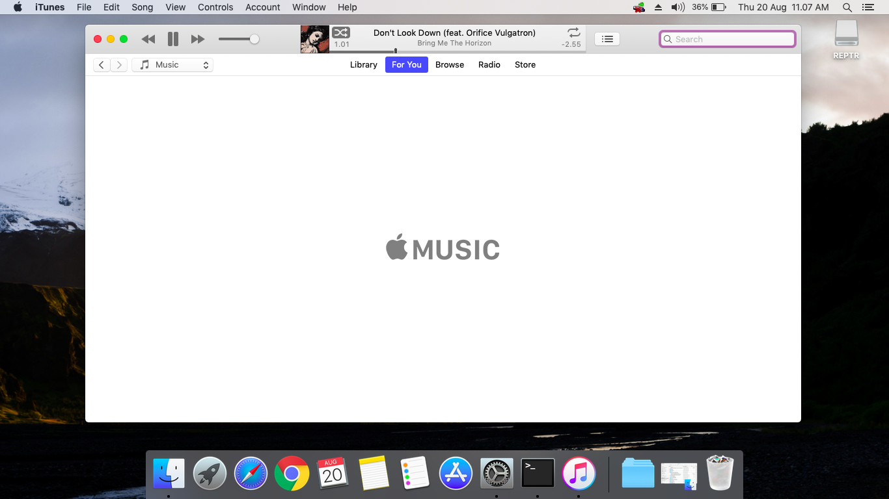
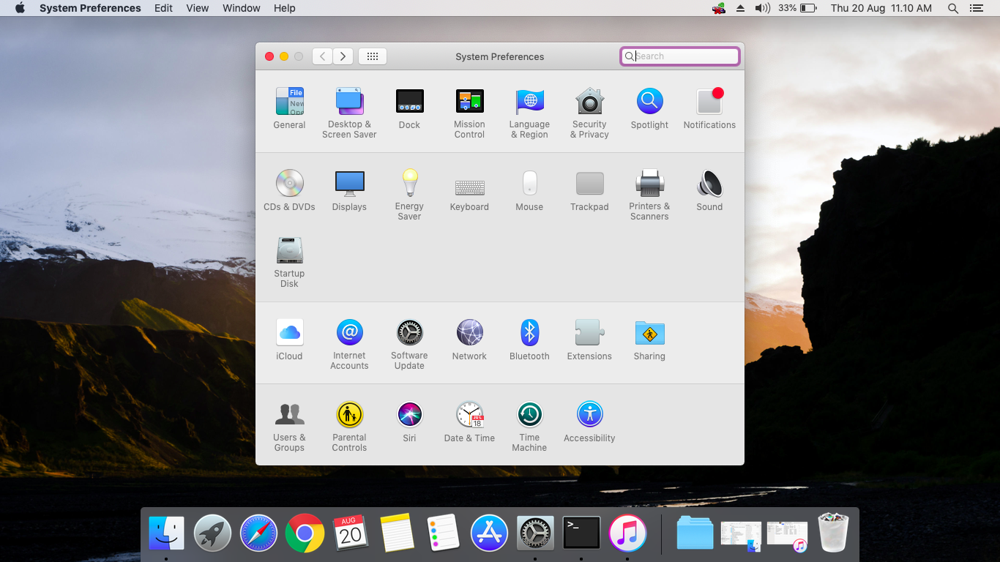
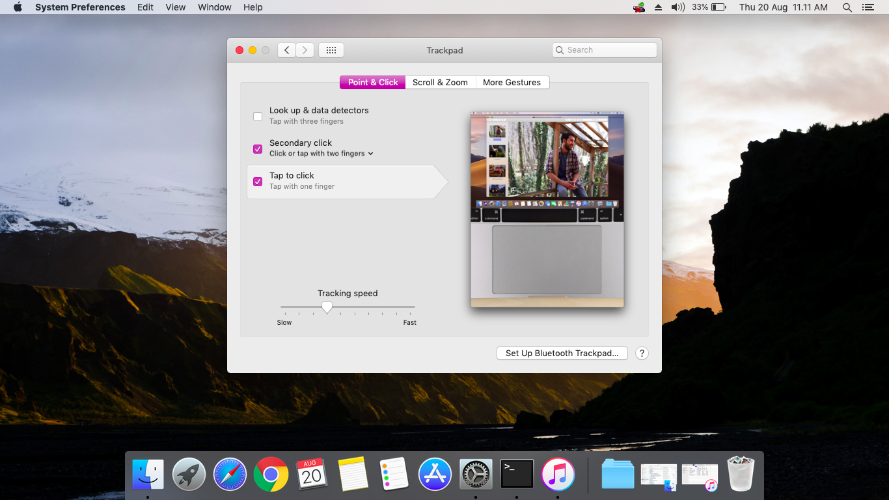
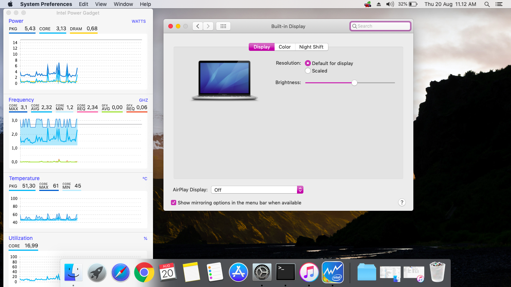
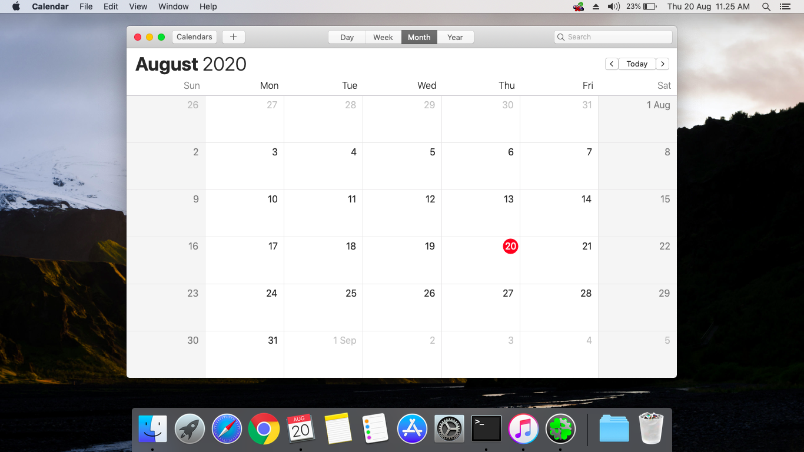

# Hackintosh Acer E5-475G

> **DO AT YOUR OWN RISK !**

## What works
- Power Management
- Brightness
- Volume Control
- Battery Information
- Audio : from internal speaker and headphone jack
- USB Ports
- DVD Drive
- Automatic OS updates
- Trackpoint
- VGA Display

## Not Tested
- FaceTime/iMessage
- Built-in Camera
- SD card reader
- Bluetooth
- Touchpad (gestures)

## Not Work
- Wifi (alternative use USB Wifi Dongle)

## Some Screenshoot
### Boot

### Mojave

### Apple Music

### Setting

### Trackpad

### Built In

### Calendar

## License

MIT License
Copyright &copy; 2020 reptr
